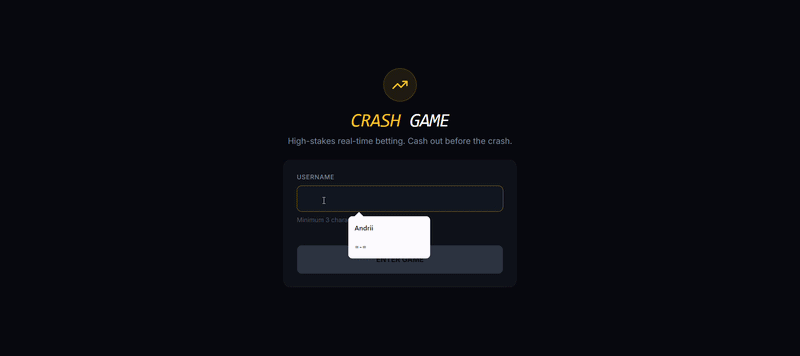

# 🚀 Crash Game

A real-time multiplayer betting game where players wager on a constantly increasing multiplier that can crash at any moment. Built with modern web technologies for a seamless, high-performance experience.

## ✨ Features

- **Real-Time Multiplayer Sync**: Fully synchronized game states across all active clients via WebSockets.
- **Dynamic Multiplier Curve**: Smooth, 60fps animations of the multiplier curve, utilizing `requestAnimationFrame` for stutter-free visuals.
- **Auto Cash-Out**: Set a target multiplier to automatically secure profits, executed reliably on the server side to eliminate latency issues.
- **Robust Session Management**: Secure API Key-based authentication that persists across sessions.
- **Live Betting Action**: Real-time updates for bet placement and cash-outs, ensuring accurate balance sync and zero latency UI states.
- **Round History**: A visual track of the most recent crash points, color-coded by the multiplier value.
- **Network Resilience**: Automatic reconnection logic with state recovery after network interruptions.
- **Interactive Audio**: Immersive game sounds for different round phases (e.g., ticking multipliers, cash out alerts).
- **Responsive iGaming UI**: A fully responsive, dark-themed UI that scales perfectly from mobile (375px) to desktop (1440px).

## 🎥 Demo



## 🛠️ Technology Stack

- **Framework:** Next.js 16+ (App Router) / React 19
- **Architecture:** Feature-Sliced Design (FSD)
- **Language:** TypeScript (Strict Mode)
- **State Management:** Zustand (Real-time state) + React Query (Server data & Caching)
- **Real-time Communication:** Socket.IO Client / WebSockets
- **Styling:** Tailwind CSS v4 + Shadcn UI
- **Animations:** Framer Motion

## 🚀 Getting Started

### Prerequisites

- Node.js (v18 or higher)
- A running instance of the Crash Game Backend (WebSocket + REST API)

### Installation

1. Clone the repository:
   ```bash
   git clone https://github.com/your-username/crash-game.git
   cd crash-game
   ```

2. Install dependencies:
   ```bash
   npm install
   ```

3. Configure environment variables:
   Create a `.env.local` file in the root directory and specify the backend URLs:
   ```env
   NEXT_PUBLIC_API_URL=http://localhost:3001
   NEXT_PUBLIC_WS_URL=ws://localhost:3001
   ```

4. Run the development server:
   ```bash
   npm run dev
   ```

5. Open [http://localhost:3000](http://localhost:3000) in your browser.

## 🎲 How to Play

1. **Enter the Game:** Connect using an API Key to identify your session and fetch your balance.
2. **Place a Bet:** During the "Waiting" phase (before the round starts), select your bet amount and click "Place Bet". Optionally set an Auto Cash-Out target.
3. **Watch the Multiplier:** The round begins, and the multiplier increases from 1.00x upwards.
4. **Cash Out:** Click "Cash Out" before the curve crashes to win your bet multiplied by the current value! If it crashes before you cash out, you lose your bet.

## 🏗️ Architecture (FSD)

This project strictly adheres to the **Feature-Sliced Design (FSD)** methodology, ensuring maximum scalability and separation of concerns:

- `src/app`: Next.js routing, global layouts, and providers.
- `src/pages`: Composition of complex application pages.
- `src/widgets`: Independent UI blocks (e.g., GameLayout, GameStage, BetPanel).
- `src/features`: User interactions and business logic (e.g., GameControls, Auth).
- `src/entities`: Core business entities (e.g., Game State, User Session).
- `src/shared`: Reusable UI components, generic hooks, and utility libraries.

## 📝 License

This project is licensed under the MIT License.
